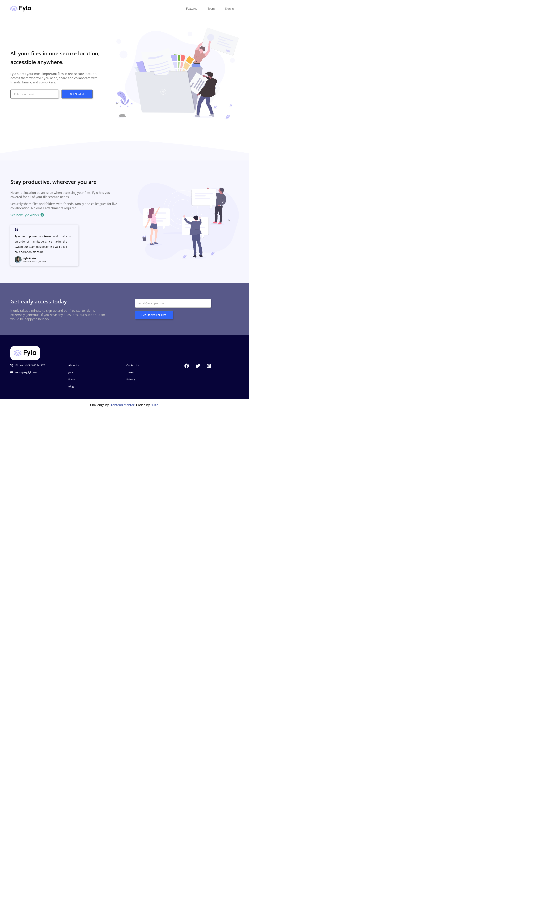

# Frontend Mentor - Fylo landing page with two column layout solution

This is a solution to the [Fylo landing page with two column layout challenge on Frontend Mentor](https://www.frontendmentor.io/challenges/fylo-landing-page-with-two-column-layout-5ca5ef041e82137ec91a50f5). Frontend Mentor challenges help you improve your coding skills by building realistic projects.

## Overview

- Nice.

### The challenge

Users should be able to:

- Can view from any devices.
- Can view hover effect.
- Can view animation.
- Accessibility.
- Useability.

### Screenshot

### Links

- Solution URL: [Asaki Hugo](https://www.frontendmentor.io/profile/AsakiHugo)

### Built with

- Semantic HTML5 markup
- CSS custom properties
- Flexbox
- CSS Grid
- JavaScript
- Mobile-first workflow
- Google Font
- Font Awesome
- Gsap

### Continued development

I want to become a web-developer so I keep trying my best.

### Useful resources

- [Google fonts](https://fonts.googleapis.com/css2?family=Epilogue:wght@500;700&display=swap) - font-family
- [Fontawesome](https://cdnjs.cloudflare.com/ajax/libs/font-awesome/6.2.1/css/all.min.css) - Icons
- [Gsap](https://cdnjs.cloudflare.com/ajax/libs/gsap/3.11.4/gsap.min.js) - Animation support

## Author

- Website - [Asaki Hugo](https://github.com/AsakiHugo)
- Frontend Mentor - [Asaki Hugo](https://www.frontendmentor.io/profile/AsakiHugo
